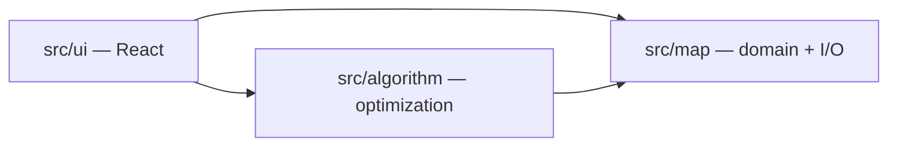

# Architecture overview

City Blockz Map Optimizer is split into three main areas under `src/`. Each owns a slice of functionality and communicates through **plain TypeScript types** and **small, explicit functions** so the UI never needs to know serialization details, and the algorithm never needs to know React.

| Area | Role |
|------|------|
| **UI** | Screens, controls, file pickers, and feedback. Calls into `map` for load/save/import/export and into `algorithm` for suggestions. |
| **Map** | In-memory model of the grid, plus **schema** for file/wire format and **serialization** glue (parse, validate, encode). |
| **Algorithm** | Pure (or mostly pure) logic: given a `GameMapState`, produce improved layouts or scores. No React, no DOM. |

## Data flow (intended)

1. User edits or imports a map in the **UI**.
2. **Map** module parses/validates external data into `GameMapState`, or encodes it for download/export.
3. **Algorithm** reads `GameMapState` and returns an optimization result (e.g. suggested placements or a new state).
4. **UI** displays results and lets the user apply or reject them.

## Where to read more

- [`src/ui/README.md`](../src/ui/README.md) — UI layer
- [`src/map/README.md`](../src/map/README.md) — map domain and I/O
- [`src/map/schema/README.md`](../src/map/schema/README.md) — save/load/import/export file shape
- [`src/algorithm/README.md`](../src/algorithm/README.md) — scoring / optimization
