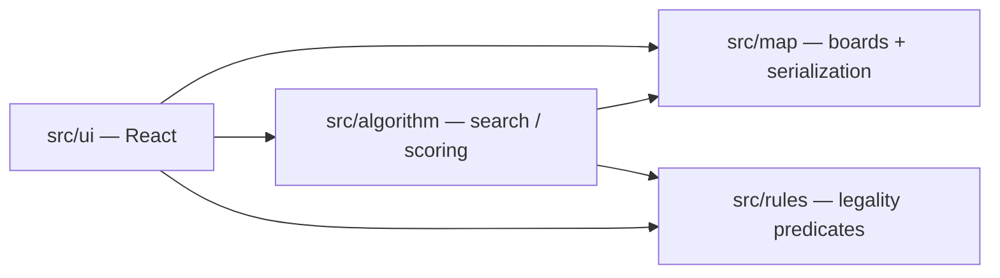

# Architecture overview

City Bloxx Map Optimizer is split into **`ui`**, **`map`**, **`rules`**, and **`algorithm`** under `src/`. Each owns a slice of functionality and communicates through **plain TypeScript types** and **small functions** so the UI never parses raw JSON blobs, algorithms never bypass legality checks, and files stay versioned cleanly.

See **[`DOMAIN.md`](./DOMAIN.md)** for board sizing, progression ideas, multi-map saves, and open questions around roofs/demolish. External wiki/review links live in **[`REFERENCES.md`](./REFERENCES.md)**.

| Area | Role |
|------|------|
| **UI** | Screens, file pickers, editor. Holds focus on one board row inside a loaded save array. Calls `map` I/O plus `algorithm`/`rules` for feedback. |
| **Map** | `BoardSpec` + `GameMapState`, coordinate helpers, **single-map** snippets vs **aggregate `SaveFileV1`** (multiple boards). |
| **Rules** | Composable predicates: adjacency ladders, roofs softening constraints, demolition side-effects (as they become known). |
| **Algorithm** | Search/improve placements under **`rules`**; reads population/scoring helpers once modelled. |

## Data flow (intended)

1. User selects or edits a board in the **UI** (possibly one among many loaded from **`SaveFileV1`**).
2. **Rules** validates proposed placements/demolitions against tiers + roofs + progression snapshot.
3. **Algorithm** explores legal moves derived from **`GameMapState` + [`evaluatePlacement`](../src/rules/placement.ts)** (or narrower helpers split out later).
4. **Serialization** maps between disks / imports and runtime structures (`decodeSaveFile`, `decodeMapFile` for narrower exports).

## Where to read more

- [`DOMAIN.md`](./DOMAIN.md)
- [`src/ui/README.md`](../src/ui/README.md)
- [`src/map/README.md`](../src/map/README.md)
- [`src/map/schema/README.md`](../src/map/schema/README.md)
- [`src/rules/README.md`](../src/rules/README.md)
- [`src/algorithm/README.md`](../src/algorithm/README.md)
